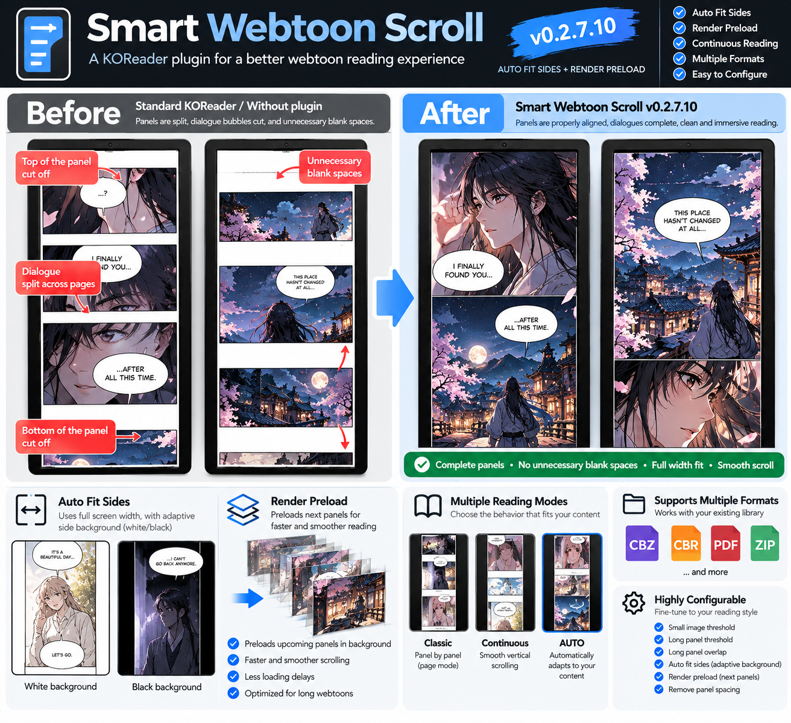

# Smart Webtoon Scroll for KOReader

<p align="center">
  
</p>

A lightweight KOReader plugin designed for **vertical webtoons stored as CBZ/CBR files**.

Instead of treating every image in the archive as a separate page, Smart Webtoon Scroll builds a **continuous vertical strip** and makes normal page turns behave more naturally for webtoon reading.

## Before → After

Without Smart Webtoon Scroll, a normal screen boundary can land in the middle of a scene, split dialogue between screens, or leave large separator areas visible. With the plugin enabled, navigation searches for a cleaner visual boundary so scenes and dialogue stay together whenever possible.

The comparison above illustrates the goal: **less arbitrary cutting, less empty space, and a more natural webtoon reading flow on an e-reader.**

## Current version

**0.2.7.10 — Auto Fit Sides + Render Preload**

This is the current tested/stable release.

## Features

- **Continuous vertical webtoon strip** — consecutive CBZ/CBR images are treated as one continuous document.
- **Smart separator snapping** — detects horizontal white or black separator bands and tries to start the next screen immediately after them.
- **Cross-file continuity** — content can continue naturally across physical image boundaries inside the archive.
- **Fit-to-Height** — content that is only slightly taller than the display can be reduced just enough to fit on one screen instead of being unnecessarily split.
- **Automatic side background** — when Fit-to-Height creates lateral margins, the plugin samples the image edges and automatically uses a black or white background to match the artwork.
- **Render preload** — pre-renders the next physical image shortly after the current screen is painted, reducing the delay when moving forward through large webtoon images.
- **Long-panel fallback** — content that cannot reasonably fit on one screen is split with a configurable overlap.
- **Blank-area skipping** — when a destination lands inside a detected white/black separator, the viewport advances to the beginning of real content.
- **Native end-of-document behavior** — at the end of the virtual strip, navigation is returned to KOReader so its normal next-document/next-CBZ behavior can take over.
- **Low-resolution analysis cache** — separator detection is deliberately lightweight and does not attempt complex panel recognition.

## How it works

Smart Webtoon Scroll does **not** try to identify individual comic panels. Each image is fitted to screen width and placed into a virtual continuous vertical strip.

When you move forward, the plugin calculates approximately one screen of movement and searches around that position for a suitable white or black horizontal separator. When one is found, the next viewport begins just after the separator. If there is no safe separator, the content is split normally with a small overlap.

For content that extends only slightly beyond the bottom of the screen, Fit-to-Height can shrink the current section within a configurable limit so that it remains intact.

## Installation

1. Download or clone this repository.
2. Make sure the plugin directory ends in `.koplugin`.
3. Copy the plugin folder into KOReader's `plugins` directory.
4. Restart KOReader.
5. Open a CBZ/CBR and enable **Smart Webtoon Scroll** from the KOReader menu.

Example directory structure:

```text
koreader/
└── plugins/
    └── smartwebtoonscroll.koplugin/
        ├── _meta.lua
        └── main.lua
```

## Settings

The plugin exposes these main controls from the KOReader menu:

- Enable continuous strip
- Fit slightly oversized content to height
- Next smart screen
- Previous smart screen
- Scroll settings
- Reset at current CBZ image

Advanced scroll settings include:

| Setting | Default | Purpose |
| --- | ---: | --- |
| Flexible search range | 24% | Area around the normal page boundary searched for a separator |
| Long-panel overlap | 3.5% | Overlap retained when long content has to be split |
| Minimum separator height | 22 px | Minimum source-image height of a white/black band |
| White threshold | 245 | How close pixels must be to pure white for white-separator detection |
| Max Fit-to-Height reduction | 12% | Maximum shrinking allowed to keep slightly oversized content together |

## Notes

The plugin is intended primarily for **fixed-layout CBZ/CBR webtoons**. It is not a panel-detection engine and deliberately avoids expensive image segmentation.

Because webtoon archives vary greatly in image dimensions, separator spacing, background color and artwork layout, some titles may benefit from adjusting the separator and overlap settings.

## Credits

The plugin was developed from the Smart Webtoon Scroll experiments for KOReader and incorporates integration/rendering ideas inspired by **Webtoon Helper 2.2.4**.

## Status

`0.2.7.10` is the current approved stable base. Future changes should be built from this version unless explicitly stated otherwise.